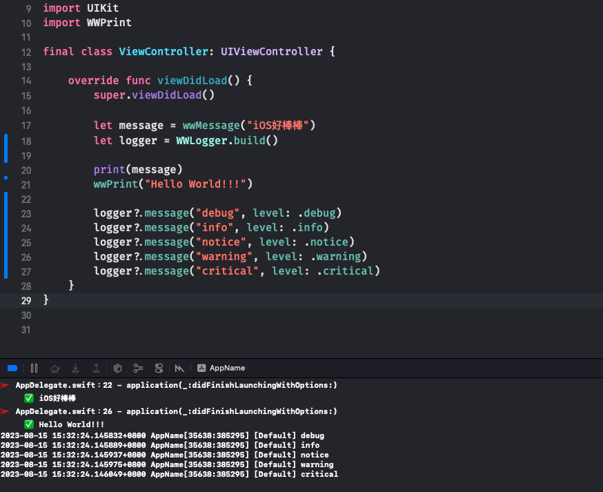

# WWPrint
[](https://developer.apple.com/swift/) [](https://developer.apple.com/swift/)  [](https://developer.apple.com/swift/) [](https://developer.apple.com/swift/)

The number of lines that can be printed + the printing method of the method name => convenient for debugging

可以印出行數 + 方法名稱的Print方法 => 方便Debug



### [Installation with Swift Package Manager](https://medium.com/彼得潘的-swift-ios-app-開發問題解答集/使用-spm-安裝第三方套件-xcode-11-新功能-2c4ffcf85b4b)
```bash
dependencies: [
    .package(url: "https://github.com/William-Weng/WWPrint.git", .upToNextMajor(from: "1.0.0"))
]
```

### Example
```swift
import UIKit
import WWPrint

final class ViewController: UIViewController {

    override func viewDidLoad() {
        super.viewDidLoad()
        
        let message = wwMessage("iOS好棒棒")
        print(message)
        
        wwPrint("Ｈello World!!!")
    }
}
```

